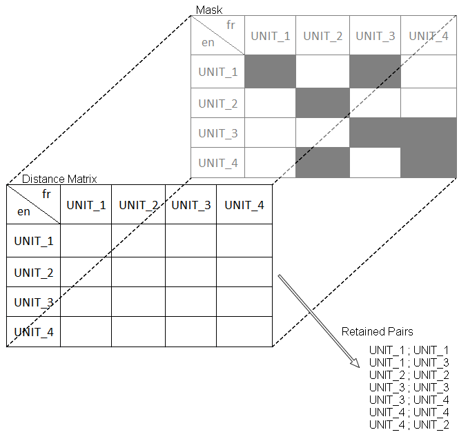

What is a mask and how's that working?
===========================

During our evaluation we use a 10-folds validation to verify our resuls.
A fold is a set of comparisons, i.e. a set of pairs of textual units to compare.
We explain in our paper that one fold are randomly built from the dataset.
In this repository, for reproducible purpose, we share the masks used to build the folds used in our evaluation.

The masks are represented by JSON files acrchived by sub-corpora in ZIP files.<br/>
For instance, the line:
```json
{"_id":{"$oid":"56bdbf0fe405a41c1f8b4569"},"0":0,"1":2,"2":"1462817114-25","3":"727911955-101"}
```
in the file `MASK_XXXX_2016-02-12_12_16_30_wiki_chunk.json` means that for this fold the comparison between the content of the file `chunk/Wikipedia/[LANG_1]/1462817114-25` and the content of the file `chunk/Wikipedia/[LANG_2]/727911955-101` constitute the first row and the third column of the distance matrix (it is that `"0":0,"1":2` means).<br/>
Where `[LANG_1]` and `[LANG_2]` are the IETF language tags for the related textual units to compare.
<br/>
<br/>
<br/>
Let a parallel corpus with four textual units in two languages (`en` and `fr`), the schema below illustrate the filter process inducing by the masks:

<p align="center"></p>
